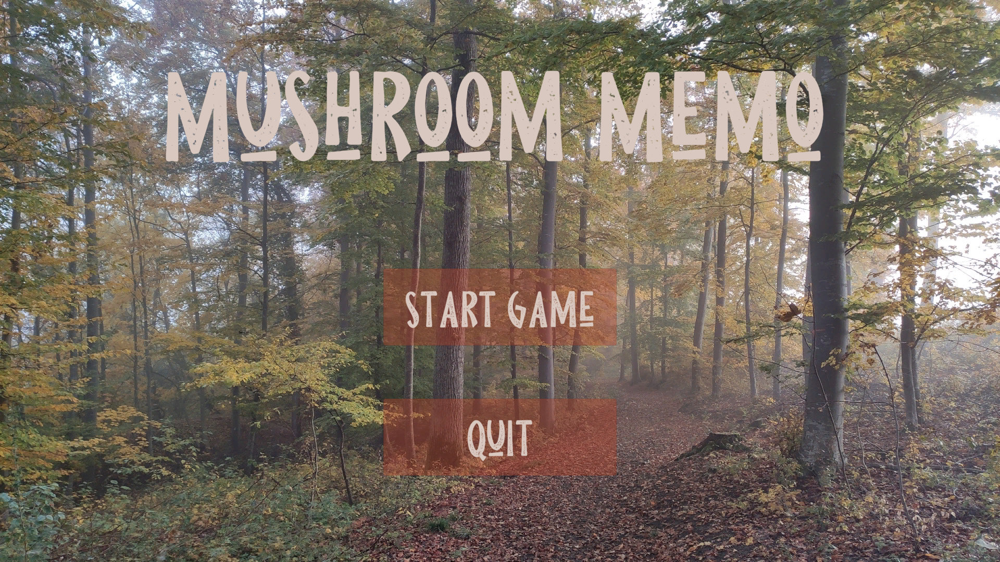
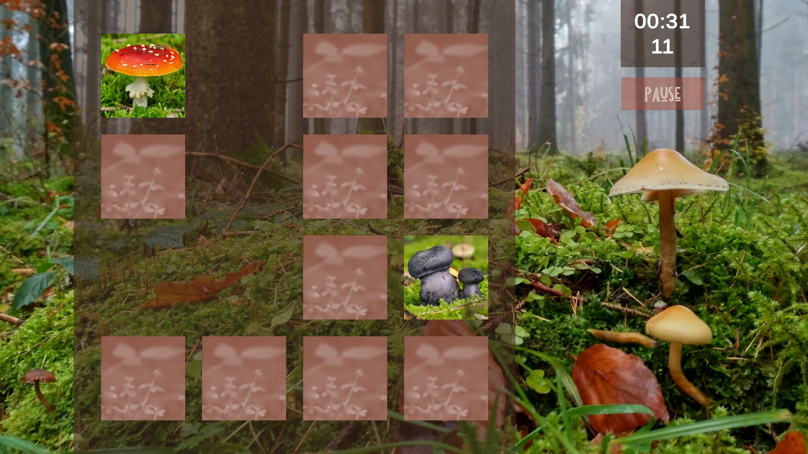
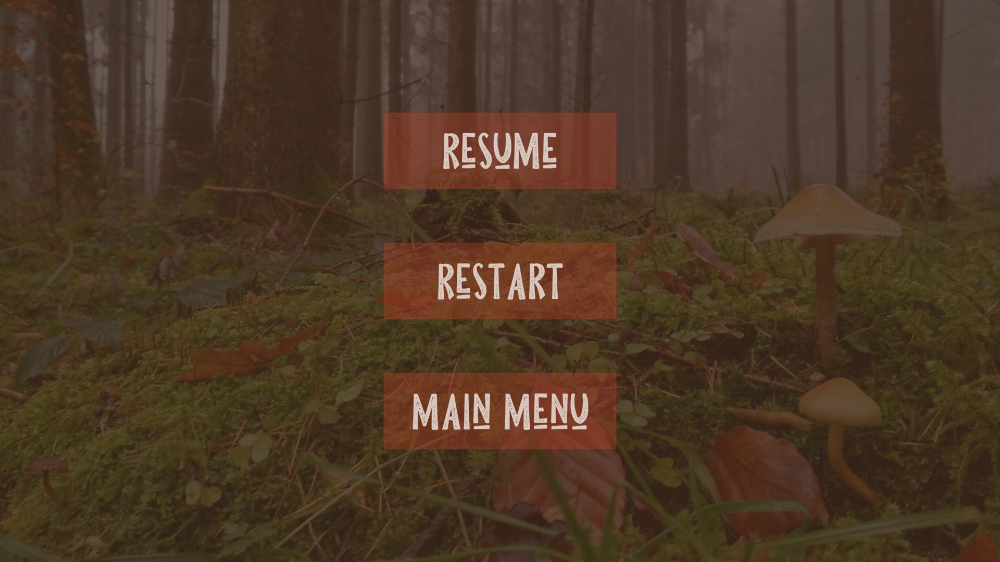
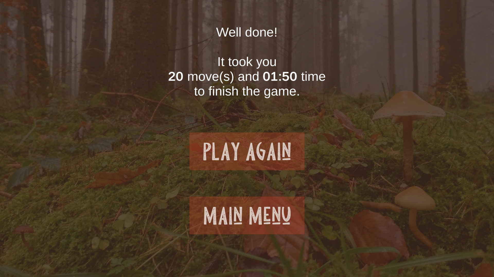

# MemoryGame
Mushroom Memo - A basic memory game in Unity

The project was based on this tutorial from "Awesome Tuts": https://www.youtube.com/watch?v=qaCjBh7bWz0&list=PLZhNP5qJ2IA2DA4bzDyxFMs8yogVQSrjW

Additional changes compared to the original tutorial:
  * Fix bug when clicking the same puzzle twice
  * Extend the board from 8 to 16 puzzles
  * Add background images
  * Add a main menu screen for easier navigation
  * Add ability to quit the game from the main menu screen
  * Make it possible to pause, resume, restart the game or return to the main menu while playing
  * Show the elapsed time
  * Count the number of moves
  * Make it possible to play again or return to the main menu when the game is finished

This is the first piece of code I wrote (and adapted) in C#, so it's probably not following the best practices. I will try to improve it as I learn more.

All the photos used in the game are my own.

Credits for the font:
Dikas Studio - Pine Forest
https://www.dafont.com/de/pine-forest.font
https://dikasstudio.com/pine-forest

Some screenshots from the game:

